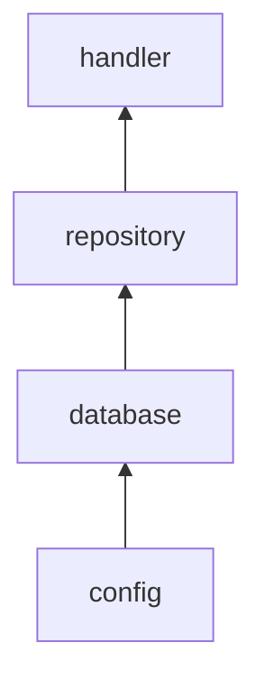

## 开发流程

1. 查看要获取网页的json信息，为设计数据库作准备
2. 设计数据库(TempRate用于储存爬取信息的数据库, 以及一个最后用于保存当日最终结果的数据库)，定义结构体(models)
3. 使用gorm框架，连接数据库
4. 测试数据库的创建
5. 将数据库登陆信息写成配置文件config(Viper)
6. 数据库CRUD操作接口定义与实现方法
7. handler(起始页面展示，从数据库获取某一天汇率，以JSON形式返回，查询最近一天汇率，查询n天前的汇率)
8. routes
9. 模版html的修改，jquery ajax
10. 定时任务(jobrunner)
11. 历史数据获取
12. 缓存
13. CI/CD
14. 前端设计

## 文件构造

1. config文件夹：读取配置文件
2. global文件夹：声明全局变量
3. handlers文件夹：定义handler
4. initialize文件夹：用配置文件连接数据库，以及创建tables
5. models文件夹：定义各种tables
6. repository文件夹：每个table所需要的功能(eg.数据库的CRUD)
7. routes文件夹：定义route
8. tasks文件夹：定义各种定时任务
9. templates文件夹：放置html文件
10. utils文件夹：爬取汇率的文件

- - -

